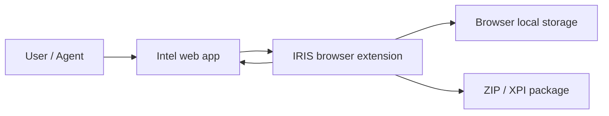

# IRIS Architecture Notes

This is a compact restart guide for IRIS. It captures current architecture and
recent decisions; the detailed chronological log remains in `docs/iris/work-items.md`
and benchmark samples remain in `docs/iris/performance-benchmarks.md`.

## Current Shape

IRIS is a browser extension backed by shared workspace packages:

- `apps/iris`: the main IRIS browser extension app.
- `apps/mini-iris`: smaller/reference extension app.
- `packages/core`: shared store, parsers, entity logic, spatial index, plugin manager.
- `packages/plugin-sdk`: plugin-facing API/types.
- `packages/plugins`: first-party plugins such as player tracker, portal labels, fills, keys, and draw tools.

`apps/iris` is intentionally treated as an app shell. Reusable logic should move
into `packages/*` only after both IRIS and Mini-IRIS have stable call sites.

## Component View

Black-box view:



White-box view:

```mermaid
flowchart TB
  subgraph Page[Page world]
    IntelPage[Intel page]
    MapRuntime[IRIS page-world MapLibre runtime]
    IntelPage <--> MapRuntime
  end

  subgraph Extension[Extension isolated world]
    Content[Content app / bridge]
    UI[Preact UI: dock, drawer, popups]
    Diagnostics[Diagnostics]
  end

  subgraph Core[@iris/core]
    Store[Zustand store]
    Parsers[Entity and endpoint parsers]
    Spatial[Spatial index]
    PluginManager[Plugin manager]
  end

  subgraph Plugins[First-party plugins]
    Tracker[Player tracker]
    Labels[Labels and fills]
    Draw[Draw tools]
    Keys[Inventory keys]
  end

  MapRuntime <--> Content
  Content <--> Store
  Parsers --> Store
  Spatial --> Store
  PluginManager --> Plugins
  Plugins --> Store
  Store --> UI
  Store --> Diagnostics
  Store --> Content
```

## Map Runtime

IRIS uses a page-world MapLibre runtime for the main map surface.

Reason:

- Firefox extension isolation made direct extension-world MapLibre feature objects
  unsafe, especially around `queryRenderedFeatures`.
- The page-world runtime owns MapLibre map interaction/rendering and sends plain
  JSON messages back to the extension UI.

Current ownership:

- Page-world runtime owns MapLibre map, source updates, layer visibility, camera
  sync, selection, contextmenu/long-press, marker pins, and Bench.
- Extension UI owns Preact popups/drawer/dock and sends typed page-runtime
  messages.
- Store updates live in `@iris/core`; routine map updates are sent as narrow
  domain patches rather than full snapshots.

## Performance Decisions

Decisions already made:

- `SpatialIndex.syncAll` uses `rbush.load()` for bulk rebuilds.
- Portal/link/field source sync uses direct store subscriptions so entity refreshes
  do not rerender the full overlay tree just to forward map data.
- Page-world sync is split by domain: portals, links, fields, plugin features,
  planned features, artifacts, ornaments, selection, mission, visual filters, and
  tiles.
- Hidden popups are mostly unmounted instead of staying subscribed while returning
  `null`.
- Diagnostics samples UI renders, long tasks, source counts/timings, and Bench
  results.
- Diagnostics itself samples heavy counters once per second to avoid a feedback
  loop where observing render counters causes more Diagnostics renders.

Benchmark variants:

- `Normal`: current visible map.
- `Base`: hides IRIS/entity/plugin/planning layers during Bench to isolate base map cost.
- `No Plugins`: keeps core entity layers but hides plugin/planning/pin overlays.

Latest desktop variant samples suggest:

- Base map and core portal/link/field rendering are not the main issue.
- Worst-frame spikes mostly disappear in `No Plugins`.
- Next measured performance work should focus on plugin overlays, marker pins,
  labels, and fill/highlighter layers.

## Diagnostics

Diagnostics currently tracks:

- Endpoint health and refresh state.
- Map source/frame performance.
- `LONGTASK` samples from `PerformanceObserver` and event-loop lag.
- `UIRENDER` samples for key UI surfaces and heavy popups.
- Recoverable domain errors from parsers, active request failures, and page-world
  runtime task failures.

Use copied Diagnostics output when comparing changes. Important lines:

```text
VIEWPORT ...
SOURCES ...
FRAME ...
LONGTASK ...
UIRENDER ...
```

## Plugins

Plugins are useful internally, but the plugin system is not yet a stable external
ecosystem. Treat `packages/plugin-sdk` as a first-party contract unless we decide
to support real external plugins.

Near-term plugin performance focus:

- Identify which plugin overlay contributes to worst-frame spikes.
- Candidate areas: player tracker pins/clusters, portal key labels, health/level
  fills, planned/draw tools, and label overlap behavior.
- Prefer diagnostics and targeted thinning before broad renderer rewrites.

## Package Boundaries

Do not split packages yet just for cleanliness.

A future split may make sense if bundle analysis shows real cost:

- `@iris/types`
- `@iris/parsers`
- `@iris/spatial`
- `@iris/store`
- `@iris/plugin-sdk`

For now, prefer sharing specific logic through the existing packages. Mini-IRIS
can benefit most from shared parsers, inventory/key logic, player tracker models,
map feature builders, diagnostics formatting, and mock data generators before any
package split.

## Backlog

Keep active follow-ups in `docs/iris/work-items.md`. This file should describe durable
architecture and decisions, not duplicate the live backlog.

## Verification

Common checks:

```bash
npm run lint:iris
npm run typecheck
```

For performance changes:

1. Enable mock tools.
2. Run Bench with `Normal`, `Base`, and `No Plugins`.
3. Copy Diagnostics after each run.
4. Compare `FRAME`, `LONGTASK`, and `UIRENDER`.
